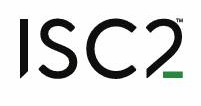
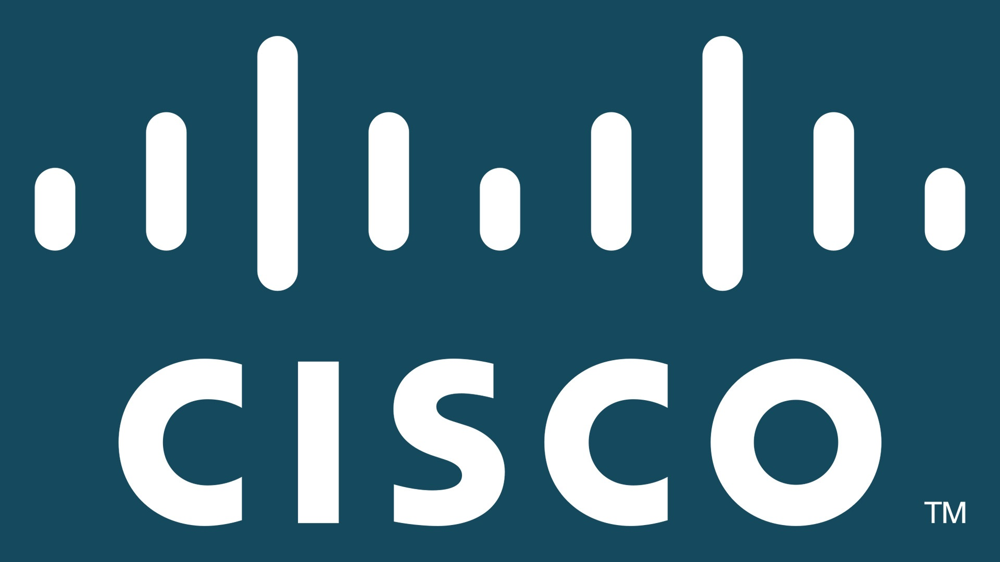
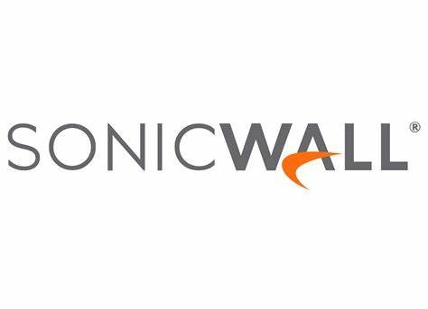
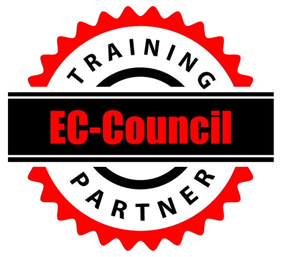

<h1>Hi, I'm Shubodaya!  <a href="https://github.com/shubodaya">Programmer</a>, <a href="https://www.linkedin.com/in/shubodaya/">Cybersecurity Professional</a></h1>

<h2>👨‍💻Projects:</h2>

- <b>Automotive Software-Defined Firewall (SDF) Framework</b>  
  - [SD-Firewall for Automotive ECUs (Scala, Python, SocketCAN)](https://github.com/shubodaya/SD-Firewall-for-Automotive-Network)  

- <b>Smartphone-Based Accident Detection & Notification System</b>  
  - [Arduino + Bluetooth + Sensors-Based Emergency Alert System](https://github.com/shubodaya/Emergency-Activation-in-Automobiles-Using-IOT)
  - [Bluetooth-Enabled Accident Alert App (MIT App Inventor)](https://github.com/shubodaya/Emergency-Activation-in-Automobiles-Using-IOT)  

- <b>Dam Gate Control System (ADA)</b>  
  - [Water Level-Based Dam Automation in ADA](https://github.com/shubodaya/Dam-Safety-Control-System)  

- <b>3D Portfolio Website</b>  
  - [3D Developer Portfolio using React & Three.js](https://github.com/shubodaya/3D-Porfolio)  

<h2>📚 Research Works:</h2>

- <b>Security and Privacy in Generative AI</b>  
  - Reviewed risks, ethical concerns, and mitigation strategies in AI models. Identified research gaps and proposed solutions for secure AI systems. 

- <b>Modern Cryptographic Techniques</b>  
  - Analyzed TLS security, ECC, RSA, and Diffie-Hellman, focusing on attack resistance and mobile/IoT security. 

- <b>Ontology-Based Access Control for IoT</b>  
  - Explored OBAC for autonomous vehicles, comparing it with RBAC/ABAC and proposing ML-driven optimizations for dynamic access control. 

- <b>IoT Accident Detection System</b>  
  - Reviewed IoT-based crash detection systems for real-time emergency alerts and improved road safety. 

---

<h2>📜 Certifications</h2>

<table>
  <tr>
    <td></td>
    <td><a href="https://www.credly.com/badges/cbea159f-fb69-4035-bbb3-5e29eef4bcb7/public_url" target="_blank" style="text-decoration: none; color: inherit;"><strong>CompTIA Network+ (N10-009)</strong></a></td>
  </tr>
  <tr>
    <td></td>
    <td><a href="https://www.credly.com/badges/9e429443-91ec-4a7e-8caf-f38af95632e5/public_url" target="_blank" style="text-decoration: none; color: inherit;"><strong>CompTIA Security+ (SY0-701)</strong></a></td>
  </tr>
  <tr>
    <td></td>
    <td><a href="https://learn.microsoft.com/api/credentials/share/en-us/Shubodaya-4297/DEC154DF18148FE2?sharingId=2B1885D06503909F" target="_blank" style="text-decoration: none; color: inherit;"><strong>Microsoft Certified: Azure Fundamentals (AZ-900)</strong></a></td>
  </tr>
  <tr>
    <td></td>
    <td><a href="https://www.credly.com/badges/f3e7e8c8-816a-4f31-8575-731e85366305/public_url" target="_blank" style="text-decoration: none; color: inherit;"><strong>(ISC)² Certified in Cybersecurity (CC)</strong></a></td>
  </tr>
  <tr>
    <td></td>
    <td>
      <a href="https://www.credly.com/badges/144daaf0-da3d-47d9-8e9a-4d0c3580fc1a/public_url" target="_blank" style="text-decoration: none; color: inherit;"><strong>Packet Tracer Certification</strong></a>, 
      <a href="https://www.credly.com/badges/3e3e57a6-4d7f-4db5-b211-ac78d7543b3d/public_url" target="_blank" style="text-decoration: none; color: inherit;"><strong>Networking Essentials</strong></a>, 
      <a href="https://www.credly.com/badges/6a45dfa6-7c08-4bbb-917a-e3b3454560aa/public_url" target="_blank" style="text-decoration: none; color: inherit;"><strong>Cybersecurity</strong></a>
    </td>
  </tr>
  <tr>
    <td></td>
    <td><strong> IT Automation with Python</strong>
      ,
      <a href="https://www.credly.com/badges/f92f11cf-31d7-4f18-84bf-9f013c2c97d5/public_url" target="_blank" style="text-decoration: none; color: inherit;"><strong> IT Support Professional</strong></a>
      , 
      <a href="https://www.credly.com/badges/41d5a54b-7a6a-4c52-ae5e-e5d7bd06be7d/public_url" target="_blank" style="text-decoration: none; color: inherit;"><strong>Cybersecurity Professional</strong></a>
    </td>
  </tr>
  <tr>
    <td></td>
    <td><strong>SNSA, SNSP</strong></td>
  </tr>
  <tr>
    <td></td>
    <td><strong>Cisco Labs, Dark Web, Cryptocurrency, Configure Juniper SRX Router, SAN and NAS Storage</strong></td>
  </tr>
  <tr>
    <td></td>
    <td><strong>CCNA, AZ-500, AZ-700, SC-200, Cybersecurity Job Simulations (PwC, Mastercard, TATA)</strong></td>
  </tr>
</table>

<h2> 🤳 Connect with me:</h2>

[][twitter]
[][linkedin]
[][instagram]

[twitter]: https://x.com/chubbihn
[instagram]: https://www.instagram.com/shubodaya_gowda/
[linkedin]: https://linkedin.com/in/shubodaya

<!--
**joshmadakor1/joshmadakor1** is a ✨ _special_ ✨ repository because its `README.md` (this file) appears on your GitHub profile.

Here are some ideas to get you started:

- 🔭 I’m currently working on ...
- 🌱 I’m currently learning ...
- 👯 I’m looking to collaborate on ...
- 🤔 I’m looking for help with ...
- 💬 Ask me about ...
- 📫 How to reach me: ...
- 😄 Pronouns: ...
- ⚡ Fun fact: ...
-->
